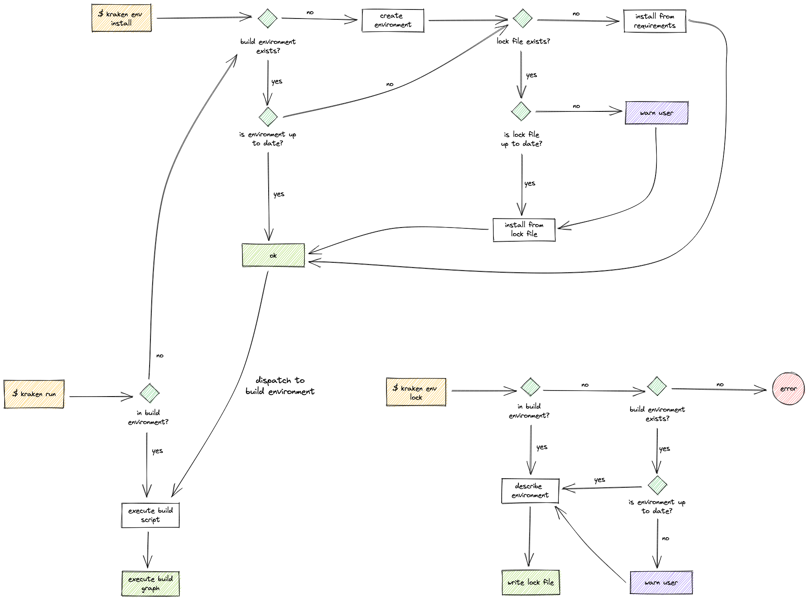

# Build Environment

The Kraken CLI manages a separate build environment in which only the requirements needed for the execution of the
build script are installed.

The build requirements are read either from the `.kraken.py` build script of the root project, or from a `.kraken.req`
file (if it exists). When read from a build script, the requirements must be at the top of the file. __Example__:

```py
# ::requirements PyYAML kraken-std
# ::requirements --extra-index-url https://test.pypi.org/simple
```

Using the `kraken env lock` or `kraken env update` command will write a lock file named **`.kraken.lock`** that is a
JSON file containing the exact installed versions.

Below is a summary of Kraken CLI's behaviour for several commands with respect to the build environment:

| Command | Behaviour |
| ------- | --------- |
| `kraken env install` | Ensure that the build environment is installed. <sup>(1)</sup> |
| `kraken env update` | Reinstall requirements, ignoring the existing lock file and write a new one. |
| `kraken env lock` | Write the lock file. Requires that the build environment exists. |
| `kraken env rm` | Delete the build environment. |
| `kraken run` | (1) |

## Workflow chart



## Environment variables

The following environment variables alter the behaviour of Kraken CLI with respect to the build environment:

| Variables | Description |
| --------- | ----------- |
| `KRAKEN_MANAGED` | If set to `1`, the Python environment from which the `kraken` command is run will be considered the build environment. No requirements will be installed and no subprocess is used to dispatch the build to a separate Python environment. |
| `KRAKEN_DEVELOP` | If set to `1`, Kraken CLI must currently be installed in develop mode and will instruct it to install the same Kraken CLI from your local file system into the build environment instead of from PyPI. |

> Note: Currently, the source directory of the kraken-cli project is derived by following the symlink of the
> `kraken/cli/__init__.py` file and then looking four directories up (cli, kraken, src, kraken-cli project root).
> This assumption is made based on how symlink installs work with `slap link` or `slap install --link`.
